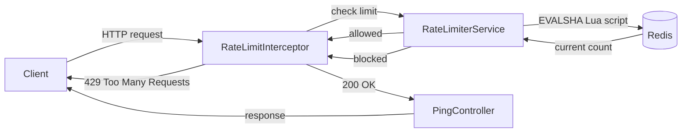

# Distributed Rate Limiter

A rate limiter built with Spring Boot and Redis that enforces request limits consistently across multiple application instances using an atomic Lua script for counting.

## Overview

Rate limiting is trivial on a single server: keep a counter in memory. It becomes a real distributed systems problem the moment you run more than one instance behind a load balancer, since an in-memory counter on one instance has no visibility into requests hitting the others.

This project solves that by moving the counter into Redis, a data store all instances share, and using a Lua script to make the increment-and-expire operation atomic. Any number of application instances can point at the same Redis and enforce a single, consistent limit.

## Architecture



Request flow:

1. A request arrives at an endpoint matching `/api/**`.
2. `RateLimitInterceptor` intercepts it before it reaches the controller and calls `RateLimiterService`.
3. `RateLimiterService` runs a Lua script on Redis that atomically increments a per-client counter and sets an expiry on first increment.
4. If the count is within the configured limit, the request proceeds to the controller. Otherwise, the interceptor short-circuits the request and returns `429 Too Many Requests`.

Because the counter and its expiry live in Redis rather than in application memory, this behaves identically whether there is one application instance or ten behind a load balancer.

## Why an atomic Lua script

A naive implementation increments a counter and separately sets its expiry:

```
INCR rate_limit:client
EXPIRE rate_limit:client 60
```

These are two separate round trips to Redis. Under concurrent load, one request can increment the counter while a second request increments it again before the first sets the expiry, or a request can crash between the two calls, leaving a key that never expires. Both are real bugs under real traffic.

Wrapping the increment and the conditional expiry in a single Lua script eliminates this. Redis executes Lua scripts atomically on its single-threaded event loop, so no other command can interleave between the increment and the expiry check, regardless of how many clients are hitting the same key at once.

## Tech stack

- Java 21
- Spring Boot 4.1
- Spring Data Redis (Lettuce client)
- Redis 7
- Docker and Docker Compose
- Maven

## Running it

Requires Docker and Docker Compose. No local Java or Maven installation is needed to run the containerized version.

```bash
https://github.com/LithikhaB/distributed-rate-limiter.git
cd distributed-rate-limiter
docker compose up --build
```

This starts two containers: `rate-limiter-app` on port 8080 and `rate-limiter-redis` on port 6379.

Test the endpoint:

```bash
curl -i http://127.0.0.1:8080/api/ping
```

The first N requests within the configured window return `200 OK`. Requests beyond the limit return `429 Too Many Requests`.

## Configuration

Limits are externalized in `application.yml` and read via `RateLimiterProperties`, no code changes required to adjust them.

```yaml
rate-limiter:
  max-requests: 10
  window-seconds: 60
```

## Verifying correctness under concurrency

`load_test.py` fires 50 requests at 20 concurrent workers against a fresh rate-limit window to confirm the limiter holds exactly at the configured threshold even under simultaneous load, not just sequential requests.

```bash
pip install requests
python load_test.py
```

Sample output:

```
Total requests fired: 50
Status code breakdown: {200: 10, 429: 40}
200 (allowed) count: 10
429 (blocked) count: 40
```

The allowed count matches `max-requests` exactly and does not drift across repeated runs, which confirms the Lua script's atomicity holds under concurrent access.

## Design notes

- **Interceptor over filter.** `HandlerInterceptor` was chosen over a raw servlet `Filter` because it integrates with Spring MVC's request mapping and configuration, making it straightforward to scope enforcement to specific path patterns via `WebConfig`.
- **Token bucket via INCR/EXPIRE over a sliding window log.** A sliding window log gives more precise rate limiting but requires storing a timestamp per request. The fixed-window counter here trades a small amount of precision at window boundaries for a much simpler and cheaper Redis footprint, appropriate for this scale.
- **Client identification.** The current implementation keys on client IP address (`HttpServletRequest.getRemoteAddr()`). A production system behind a reverse proxy would instead key on an API key or authenticated user ID, and would need to account for `X-Forwarded-For` headers.

## Project structure

```
distributed-rate-limiter/
├── src/main/java/com/lithikha/rate_limiter/
│   ├── RateLimiterApplication.java
│   ├── RateLimiterService.java       # atomic Redis logic
│   ├── RateLimitInterceptor.java     # request interception
│   ├── RateLimiterProperties.java    # externalized config
│   ├── WebConfig.java                # interceptor registration
│   └── PingController.java           # test endpoint
├── src/main/resources/application.yml
├── docker-compose.yml
├── Dockerfile
├── load_test.py
└── README.md
```

## Possible extensions

- Sliding window log or leaky bucket algorithm as an alternative strategy
- Per-endpoint limits rather than a single global limit
- Authenticated client identity instead of IP address
- Horizontal scaling test with multiple application instances behind a load balancer, all sharing the same Redis
